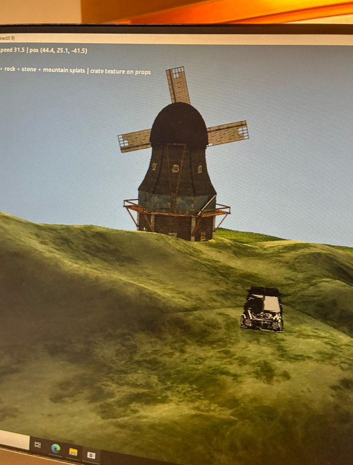
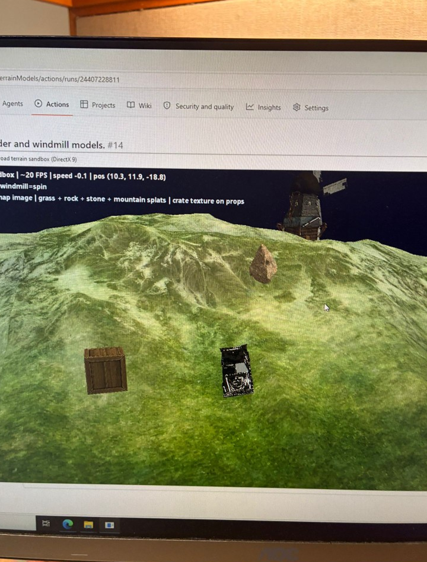
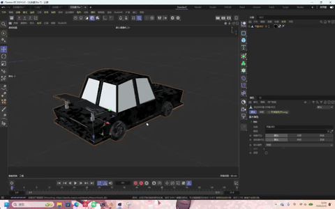
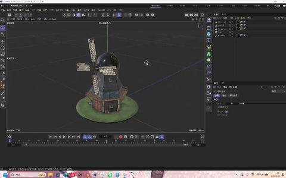
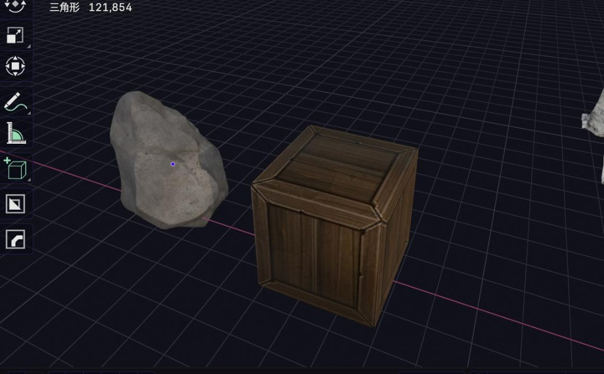
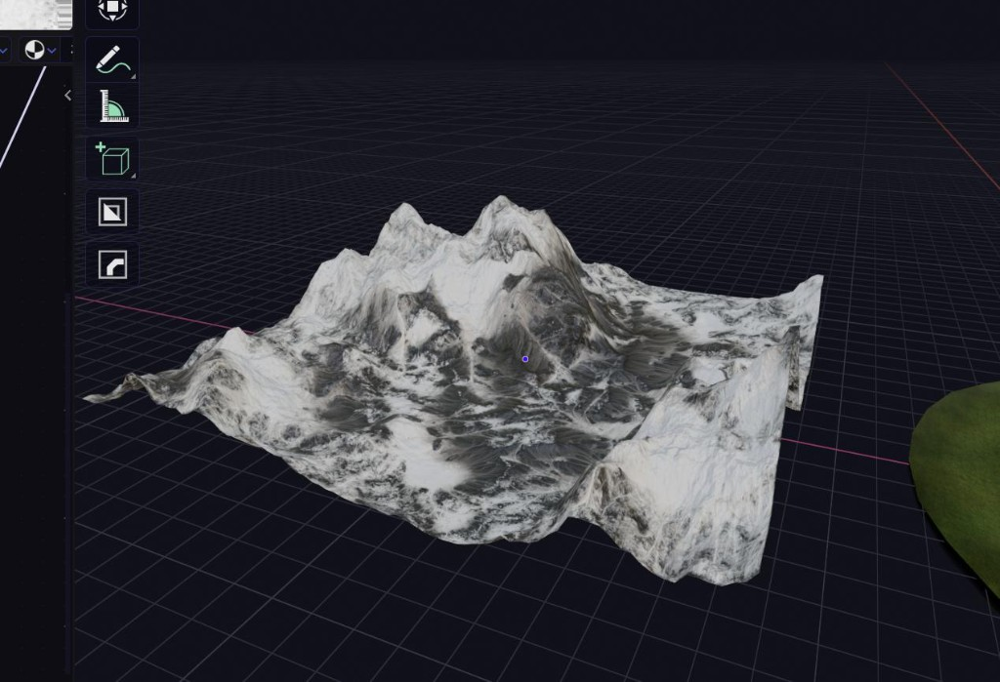

# MAEG4060 — Off-road terrain sandbox (DirectX 9)

**Repository:** [github.com/Rex-Yim/Direct3DTerrainModels](https://github.com/Rex-Yim/Direct3DTerrainModels) · [Actions](https://github.com/Rex-Yim/Direct3DTerrainModels/actions)

Course project: an interactive **DirectX 9.0c** sandbox on procedural mountainous terrain—vehicle dynamics, splatted terrain, props, and a windmill with hierarchy animation (`.x` / `ID3DXAnimationController` when present) or static-mesh drawing with code-driven motion when not.

## Screenshots

Crops match **Figure 1** and **Figure 2** in [`docs/stageFinal.pdf`](docs/stageFinal.pdf) (same trimming as the LaTeX build).

**Figure 1 — Running build:** terrain splatting, windmill, props, and HUD.

**Figure 2 — CI:** GitHub Actions run for the *boulder and windmill models* workflow, with the application visible in the run summary.

**Cinema 4D viewports** (same sessions as [`docs/media/c4d-*.mp4`](docs/media/); GIFs for inline README playback):

| Jeep (source mesh) | Windmill (source mesh) |
| --- | --- |
|  |  |

Full recordings: [`docs/media/c4d-car-viewport.mp4`](docs/media/c4d-car-viewport.mp4), [`docs/media/c4d-windmill-viewport.mp4`](docs/media/c4d-windmill-viewport.mp4).

**Modeling tool stills** (crate/boulder and terrain reference meshes—these appear as figures in the **3D models** section of [`docs/stageFinal.pdf`](docs/stageFinal.pdf)):

| Props | Terrain reference |
| --- | --- |
|  |  |

## Repository layout

- **Source:** [`src/`](https://github.com/Rex-Yim/Direct3DTerrainModels/tree/main/src) — entry [`main.cpp`](https://github.com/Rex-Yim/Direct3DTerrainModels/blob/main/src/main.cpp), [`Game.cpp`](https://github.com/Rex-Yim/Direct3DTerrainModels/blob/main/src/Game.cpp), terrain, vehicle, graphics, animation, input.
- **Build:** [`CMakeLists.txt`](https://github.com/Rex-Yim/Direct3DTerrainModels/blob/main/CMakeLists.txt) — target `maeg4060_stage2` (Windows, MSVC, C++17, DirectX 9 / D3DX, optional XInput).
- **Assets:** [`Assets/`](https://github.com/Rex-Yim/Direct3DTerrainModels/tree/main/Assets) — models, textures, terrain references.
- **Docs:** [`stageOne.pdf`](docs/stageOne.pdf), [`stageTwo.pdf`](docs/stageTwo.pdf), and [`stageFinal.pdf`](docs/stageFinal.pdf) (course stages), plus [`User_Guide.pdf`](docs/User_Guide.pdf), live in [`docs/`](docs/). Replace [`stageFinal.pdf`](docs/stageFinal.pdf) with your own export if needed. LaTeX sources are in [`docs/latex/`](docs/latex/). Rebuild with `make` or [`docs/build-docs.bat`](docs/build-docs.bat) (see [`docs/README.md`](docs/README.md)).

See [`docs/User_Guide.pdf`](docs/User_Guide.pdf) (source: [`docs/latex/user_guide.tex`](docs/latex/user_guide.tex)) for controls, requirements, and how to run the executable.

## License / course

Academic coursework (CUHK MAEG4060). Authorship of the shipped meshes and how they are integrated in-engine are described in the report (section *3D models: authorship and engine integration*).
