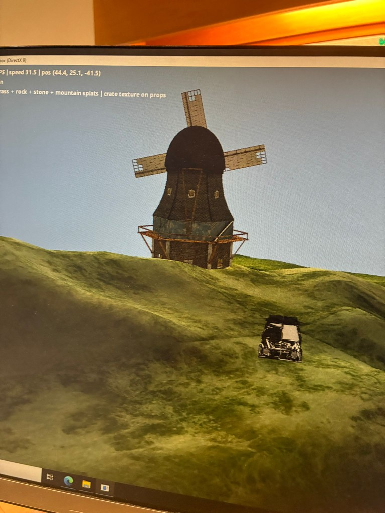
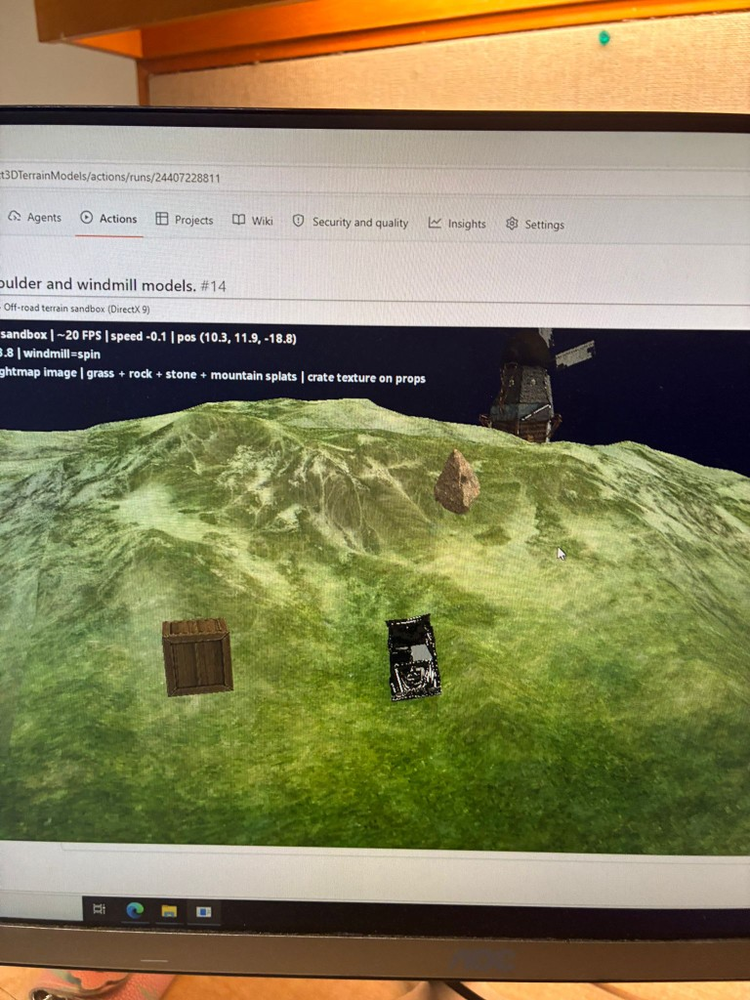

# MAEG4060 — Off-road terrain sandbox (DirectX 9)

Course project: an interactive **DirectX 9.0c** sandbox on procedural mountainous terrain—vehicle dynamics, splatted terrain, props, and a windmill with Maya-exported animation (`.X` / `ID3DXAnimationController`).

## Screenshots

**Running build** — terrain splatting, windmill, props, and HUD:

**CI** — GitHub Actions run for the *boulder and windmill models* workflow, with the application visible in the run summary:

## Repository layout

- **Source:** `src/` — entry `main.cpp`, `Game.cpp`, terrain, vehicle, graphics, animation, input.
- **Build:** `CMakeLists.txt` — target `maeg4060_stage2` (Windows, MSVC, C++17, DirectX 9 / D3DX, optional XInput).
- **Assets:** `Assets/` — models, textures, terrain references.
- **Docs:** **`stageOne.pdf`**, **`stageTwo.pdf`**, and **`stageFinal.pdf`** (course stages), plus **`User_Guide.pdf`**, live in **`docs/`**. Replace **`stageFinal.pdf`** with your own export if needed. LaTeX sources are in **`docs/latex/`**. Rebuild with `make` or `docs/build-docs.bat` (see **`docs/README.md`**).

See **`docs/User_Guide.pdf`** (source: `docs/latex/user_guide.tex`) for controls, requirements, and how to run the executable.

## License / course

Academic coursework (CUHK MAEG4060). Third-party 3D assets are credited in the report (section *3D models: sources and modifications*).
